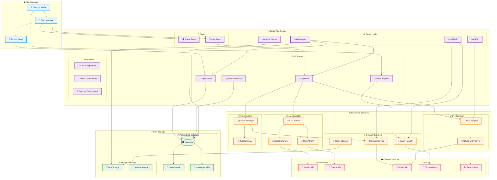

# Architecture Topology

```mermaid
graph TB
  %% User Interface Layer
  subgraph "🖥️ Client Browser"
    UI["💬 Chat Interface"]
    TP["🎫 Tickets Panel"]
    SM["⚙️ Settings Modal"]

    UI -.-> TP
    SM --> UI
  end

  %% Application Layer
  subgraph "⚛️ Next.js App Router"
    subgraph "📱 Pages"
      HP["🏠 Home Page"]
      CP["💬 Chat Page"]
    end
    
    subgraph "🔌 API Routes"
      CHAT["🔗 /api/chat"]
      AUTH["🔐 /api/auth/gitlab"]
      THREADS["📝 /api/threads"]
      SUMM["📋 /api/summarize"]
    end
    
    subgraph "🧩 Components"
      COMP["💬 Chat Components"]
      TICK["🎫 Ticket Components"]
      SETT["⚙️ Settings Components"]
    end
    
    subgraph "🪝 React Hooks"
      HMS["useMessages"]
      HGL["useGitLab"]
      HMC["useMCP"]
      HST["useStoredGitLab"]
    end
  end

  %% Services Layer
  subgraph "🛠️ Services & Libraries"
    subgraph "🤖 LLM Integration"
      LLM["🧠 LLM Service"]
      GOOGLE["🔮 Google Gemini"]
      OPENAI["🤖 OpenAI GPT"]
    end
    
    subgraph "🦊 GitLab Integration"
      GLS["🛠️ GitLab Service"]
      OAUTH["🔐 OAuth Handler"]
      STORAGE["💾 Token Storage"]
    end
    
    subgraph "🔗 MCP Integration"
      MCP["🔌 MCP Adapter"]
      MCPGL["🦊 GitLab MCP Server"]
    end
    
    subgraph "🎫 Ticket System"
      TMAN["📋 Ticket Manager"]
      ZOD["✅ Zod Schemas"]
    end
  end

  %% Data Layer
  subgraph "💾 Data Storage"
    subgraph "🗄️ PostgreSQL Database"
      DB[("🗃️ Database")]
      THREADS_T["📝 threads table"]
      MESSAGES_T["💬 messages table"]
    end
    
    subgraph "🌐 Browser Storage"
      LS["💾 localStorage"]
      SS["🧠 sessionStorage"]
    end
  end

  %% External Services
  subgraph "☁️ External Services"
    subgraph "🦊 GitLab"
      GL_API["🔌 GitLab API"]
      GL_OAUTH["🔐 GitLab OAuth"]
      GL_REPOS["📚 Repositories"]
    end
    
    subgraph "🧠 AI Providers"
      GM_API["🔮 Gemini API"]
      OAI_API["🤖 OpenAI API"]
    end
  end

  %% User Flow Connections
  UI --> HP
  UI --> CP
  CP --> CHAT
  TP --> THREADS
  SM --> AUTH

  %% API Connections
  CHAT --> LLM
  CHAT --> MCP
  CHAT --> TMAN
  AUTH --> OAUTH
  THREADS --> DB
  SUMM --> DB

  %% Hook Connections
  HMS --> CHAT
  HMS --> THREADS
  HMS --> DB
  HGL --> GLS
  HGL --> OAUTH
  HST --> LS
  HMC --> MCP

  %% Service Connections
  LLM --> GOOGLE
  LLM --> OPENAI
  GOOGLE --> GM_API
  OPENAI --> OAI_API
  
  GLS --> GL_API
  OAUTH --> GL_OAUTH
  STORAGE --> LS
  
  MCP --> MCPGL
  MCPGL --> GL_API
  MCPGL --> GL_REPOS
  
  TMAN --> ZOD
  TMAN --> GLS

  %% Database Connections
  DB --> THREADS_T
  DB --> MESSAGES_T

  %% Styling
  classDef clientLayer fill:#e1f5fe,stroke:#0288d1,stroke-width:2px
  classDef appLayer fill:#f3e5f5,stroke:#7b1fa2,stroke-width:2px
  classDef serviceLayer fill:#fff3e0,stroke:#f57c00,stroke-width:2px
  classDef dataLayer fill:#e8f5e8,stroke:#388e3c,stroke-width:2px
  classDef externalLayer fill:#ffebee,stroke:#d32f2f,stroke-width:2px

  class UI,TP,SM clientLayer
  class HP,CP,CHAT,AUTH,THREADS,SUMM,COMP,TICK,SETT,HMS,HGL,HMC,HST appLayer
  class LLM,GOOGLE,OPENAI,GLS,OAUTH,STORAGE,MCP,MCPGL,TMAN,ZOD serviceLayer
  class DB,THREADS_T,MESSAGES_T,LS,SS dataLayer
  class GL_API,GL_OAUTH,GL_REPOS,GM_API,OAI_API externalLayer
```
