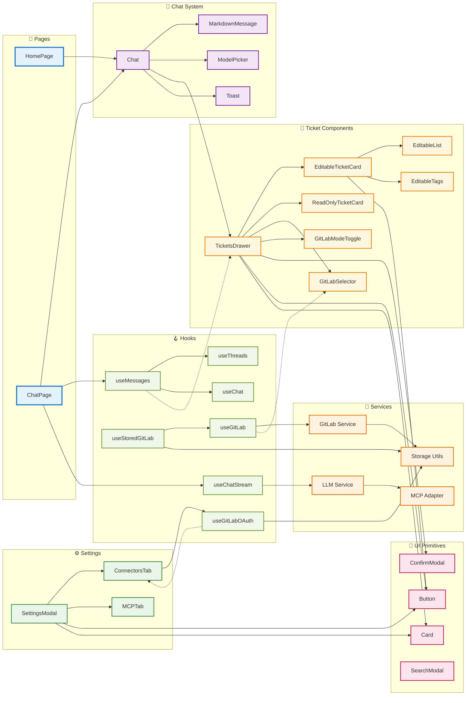

# Architecture Topology

```mermaid
graph LR
    %% Page Level Components
    subgraph "📱 Pages"
        HP[HomePage]
        CP[ChatPage]
    end

    %% Core Chat Components
    subgraph "💬 Chat System"
        CHAT[Chat]
        MM[MarkdownMessage]
        MP[ModelPicker]
        TS[Toast]
    end

    %% Ticket Management
    subgraph "🎫 Ticket Components"
        TD[TicketsDrawer]
        ETC[EditableTicketCard]
        RTC[ReadOnlyTicketCard]
        EL[EditableList]
        ET[EditableTags]
        GS[GitLabSelector]
        GMT[GitLabModeToggle]
    end

    %% Settings & Configuration
    subgraph "⚙️ Settings"
        SM[SettingsModal]
        CT[ConnectorsTab]
        MCT[MCPTab]
    end

    %% UI Primitives
    subgraph "🧱 UI Primitives"
        BTN[Button]
        CARD[Card]
        CM[ConfirmModal]
        SM_COMP[SearchModal]
    end

    %% React Hooks
    subgraph "🪝 Hooks"
        HMS[useMessages]
        HCS[useChatStream]
        HGL[useGitLab]
        HSG[useStoredGitLab]
        HOA[useGitLabOAuth]
        HT[useThreads]
        HC[useChat]
    end

    %% Services & Libraries
    subgraph "🔧 Services"
        GLS[GitLab Service]
        STOR[Storage Utils]
        LLM[LLM Service]
        MCP[MCP Adapter]
    end

    %% Page Relationships
    HP --> CHAT
    CP --> CHAT
    CP --> HMS
    CP --> HCS

    %% Chat Component Relationships
    CHAT --> MM
    CHAT --> MP
    CHAT --> TD
    CHAT --> TS
    
    %% Ticket Component Relationships
    TD --> ETC
    TD --> RTC
    TD --> GS
    TD --> GMT
    TD --> CM
    ETC --> EL
    ETC --> ET
    
    %% Settings Relationships
    SM --> CT
    SM --> MCT
    CT --> HOA
    
    %% UI Primitive Usage
    TD --> BTN
    TD --> CARD
    SM --> BTN
    SM --> CARD
    ETC --> BTN

    %% Hook Dependencies
    HMS --> HT
    HMS --> HC
    HSG --> HGL
    HSG --> STOR
    HGL --> GLS
    HOA --> STOR
    HCS --> LLM

    %% Service Dependencies
    GLS --> STOR
    LLM --> MCP

    %% Data Flow Connections
    HMS -.-> TD
    HGL -.-> GS
    HOA -.-> CT

    %% Styling
    classDef pageLevel fill:#e3f2fd,stroke:#1976d2,stroke-width:3px
    classDef chatSystem fill:#f3e5f5,stroke:#7b1fa2,stroke-width:2px
    classDef ticketSystem fill:#fff8e1,stroke:#f57c00,stroke-width:2px
    classDef settings fill:#e8f5e8,stroke:#388e3c,stroke-width:2px
    classDef primitives fill:#fce4ec,stroke:#c2185b,stroke-width:2px
    classDef hooks fill:#f1f8e9,stroke:#689f38,stroke-width:2px
    classDef services fill:#fff3e0,stroke:#ef6c00,stroke-width:2px

    class HP,CP pageLevel
    class CHAT,MM,MP,TS chatSystem
    class TD,ETC,RTC,EL,ET,GS,GMT ticketSystem
    class SM,CT,MCT settings
    class BTN,CARD,CM,SM_COMP primitives
    class HMS,HCS,HGL,HSG,HOA,HT,HC hooks
    class GLS,STOR,LLM,MCP services
```
