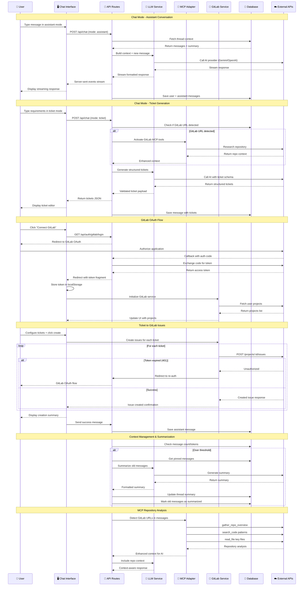

# Sequence Diagram

```mermaid
sequenceDiagram
    participant U as 👤 User
    participant C as 🖥️ Chat Interface
    participant API as 🔌 API Routes
    participant LLM as 🤖 LLM Service
    participant MCP as 🔗 MCP Adapter
    participant GL as 🦊 GitLab Service
    participant DB as 💾 Database
    participant EXT as ☁️ External APIs

    Note over U,EXT: Chat Mode - Assistant Conversation
    U->>C: Type message in assistant mode
    C->>API: POST /api/chat (mode: assistant)
    API->>DB: Fetch thread context
    DB-->>API: Return messages + summary
    API->>LLM: Build context + new message
    LLM->>EXT: Call AI provider (Gemini/OpenAI)
    EXT-->>LLM: Stream response
    LLM-->>API: Stream formatted response
    API-->>C: Server-sent events stream
    C-->>U: Display streaming response
    API->>DB: Save user + assistant messages

    Note over U,EXT: Chat Mode - Ticket Generation
    U->>C: Type requirements in ticket mode
    C->>API: POST /api/chat (mode: ticket)
    API->>DB: Check if GitLab URL detected
    alt GitLab URL detected
        API->>MCP: Activate GitLab MCP tools
        MCP->>EXT: Research repository
        EXT-->>MCP: Return repo context
        MCP-->>API: Enhanced context
    end
    API->>LLM: Generate structured tickets
    LLM->>EXT: Call AI with ticket schema
    EXT-->>LLM: Return structured tickets
    LLM-->>API: Validated ticket payload
    API-->>C: Return tickets JSON
    C-->>U: Display ticket editor
    API->>DB: Save message with tickets

    Note over U,EXT: GitLab OAuth Flow
    U->>C: Click "Connect GitLab"
    C->>API: GET /api/auth/gitlab/login
    API-->>U: Redirect to GitLab OAuth
    U->>EXT: Authorize application
    EXT-->>API: Callback with auth code
    API->>EXT: Exchange code for token
    EXT-->>API: Return access token
    API-->>C: Redirect with token fragment
    C->>C: Store token in localStorage
    C->>GL: Initialize GitLab service
    GL->>EXT: Fetch user projects
    EXT-->>GL: Return projects list
    GL-->>C: Update UI with projects

    Note over U,EXT: Ticket to GitLab Issues
    U->>C: Configure tickets + click create
    C->>GL: Create issues for each ticket
    loop For each ticket
        GL->>EXT: POST /projects/:id/issues
        alt Token expired (401)
            EXT-->>GL: Unauthorized
            GL->>API: Redirect to re-auth
            API-->>U: GitLab OAuth flow
        else Success
            EXT-->>GL: Created issue response
            GL-->>C: Issue created confirmation
        end
    end
    C-->>U: Display creation summary
    C->>API: Send success message
    API->>DB: Save assistant message

    Note over U,EXT: Context Management & Summarization
    API->>DB: Check message count/tokens
    alt Over threshold
        API->>DB: Get pinned messages
        API->>LLM: Summarize old messages
        LLM->>EXT: Generate summary
        EXT-->>LLM: Return summary
        LLM-->>API: Formatted summary
        API->>DB: Update thread summary
        API->>DB: Mark old messages as summarized
    end

    Note over U,EXT: MCP Repository Analysis
    API->>MCP: Detect GitLab URLs in messages
    MCP->>EXT: gather_repo_overview
    MCP->>EXT: search_code patterns
    MCP->>EXT: read_file key files
    EXT-->>MCP: Repository analysis
    MCP-->>API: Enhanced context for AI
    API->>LLM: Include repo context
    LLM-->>API: Context-aware response
```
